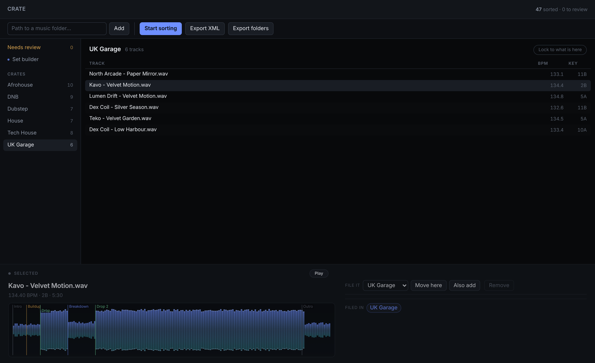
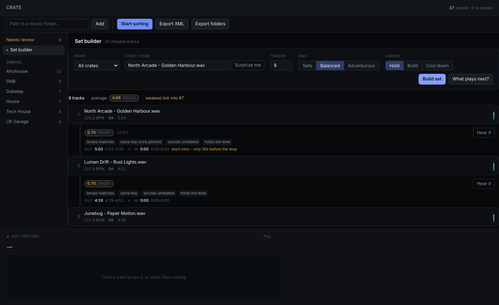

# Crate

**A local app that sorts a DJ library into crates by listening to the audio, learns from every correction, and builds mixable sets.**

Crate analyses each track's tempo, key, structure (intro, buildup, drop, breakdown, outro), and genre, then files it into the DJ's own crates. Anything it isn't sure about goes to a review queue instead of being silently misfiled. Results export straight to Rekordbox, with hot cues on every downbeat-aligned drop and breakdown.





<sub>Screenshots use a demo library of made-up tracks.</sub>

## Highlights

- **Sorts from the sound, not the filename.** Discogs-EffNet audio embeddings (Essentia/TensorFlow) feed a classifier trained on the DJ's own crates.
- **93% held-out accuracy** on 530 distinct labelled recordings, up from about 75% for audio alone, by combining an acapella detector, the store's genre tag, and artist history ahead of the audio model. Every step was measured. See `CLAUDE.md` for the experiments that didn't work.
- **Honest when unsure.** Low-confidence tracks land in *Needs review*. Corrections ("move here" / "also add") retrain the model in the background.
- **Set builder.** Scores every transition on tempo, Camelot key, energy, and sound, then picks exact mix-out and mix-in points. You can preview a transition before playing it.
- **Rekordbox export.** Generates `rekordbox.xml` with genre, BPM, key, a playlist per crate, and coloured hot cues, or exports crates as folders.
- **Never touches your music.** The library is read-only. Crates live in a local SQLite database.
- **Private by design.** Runs entirely on your machine. The local server only accepts requests from its own page.
- **268 automated tests** (`pytest`).

## Tech stack

Python 3.9+ · Essentia + TensorFlow (Discogs-EffNet) · NumPy · scikit-learn (training only) · SQLite · stdlib `http.server` · vanilla JavaScript UI, no framework or build step.

## The sorting app

```bash
./setup.sh          # once: creates .venv, installs Essentia, downloads models
./crate.command     # or double-click it in Finder
```

The app opens at `http://127.0.0.1:8420`. Paste a music folder path, click **Add**, then **Start sorting**. The catalogue is stored in `~/.crate/library.db`, and only new or changed files are analysed on later runs.

## Tests

```bash
source .venv/bin/activate
pip install pytest
python -m pytest -q
```

---

## Command-line analyser

The original one-shot analyser is still included. It writes a standalone viewer and a Rekordbox XML for a single folder.

### Install

```bash
chmod +x setup.sh
./setup.sh
```

Takes a few minutes — TensorFlow is a large download. Only needed once.

### Run

```bash
source .venv/bin/activate
python analyze.py ~/Desktop/AllSongs -o ~/Desktop/crate_output
```

Useful flags:

| Flag | What it does |
|---|---|
| `--limit 20` | Stop after 20 files. Do this first to sanity-check the output. |
| `--resume` | Skip files already analysed. Safe to Ctrl-C and restart. |
| `-o FOLDER` | Where results go. |

Roughly 8–12 seconds per track on Apple Silicon. A 930-track library is about
two to three hours — start it and leave it. `--resume` means an interrupted run
picks up where it stopped.

## What you get

**`viewer.html`** — open it in a browser. Track list on the left, and clicking a
track shows its energy timeline with every cue point marked, plus every measured
value. Filter by category, by "needs review", or by vocals only. Click "Load
audio folder" and point it at your music to get playback — then clicking a cue
jumps straight to that moment.

**`rekordbox.xml`** — Rekordbox → File → Import Collection. Brings in genre,
BPM, key and a memory cue at every detected moment.

**`library.csv`** — one row per track, for spreadsheets or your own scripts.

**`results.json`** — everything, including the raw energy curves.

## How genre is decided

Audio is converted to a mel-spectrogram, run through Discogs-EffNet to get an
embedding, and classified against 400 Discogs genre and style labels.

The Discogs taxonomy is the reason this is worth doing. The common
GTZAN-trained models know ten broad genres and no electronic subgenres at all —
they cannot tell UK Garage from Deep House. Discogs400 can, because Discogs'
own catalogue makes that distinction.

Every prediction carries a confidence score. Anything under 0.15 is flagged
rather than filed, and the top five candidates are always kept so you can see
what the second guess was.

## Acapellas

Acapellas are detected before genre is considered and filed under **Vocals**.

A genre classifier is trained on full mixes. Hand it an isolated vocal and it
has no drums, no bassline and no production style left to work with, so it
guesses from vocal timbre alone — confidently and often wrongly. Detecting the
acapella first and refusing to assign a genre is the honest answer.

Detection uses four independent signals: almost no sub-bass energy, vocal-range
frequencies dominant, few percussive onsets, and a thin low end relative to
mids. Three of four routes it to Vocals; two of four flags it for review rather
than deciding. The viewer shows which signals fired, so you can check the
reasoning instead of trusting a label.

## Cue points

Every cue lands on a downbeat. An off-grid cue is useless on a CDJ, so all
timing is snapped to the beat grid.

- **Drop** — sub-bass and kick return with a measurable energy lift
- **Breakdown** — sub-bass drops out while mids and highs continue
- **Buildup** — energy and brightness climbing together into a drop
- **Intro / Outro** — leading and trailing low-energy sections
- **Main section** — sustained full energy without a preceding lift

The detector is deliberately conservative. A track with no dynamic range gets
few cues, which is correct — better a missing cue than a false one you have to
find and delete on 900 tracks.

## Reading the flags

`needs_review` means something was uncertain and nothing was invented:

- genre confidence below 0.15
- possible acapella, evidence split
- low beat-tracking confidence, so cue positions may be off-grid

Filter to these in the viewer and work through them by ear. On a large library
this is usually a small fraction of the total.

## Accuracy notes

**Bootlegs and mashups** blend two source genres. The model returns one label
plus its runners-up — check the alternates before accepting the top answer.

**Tempo** is generally very good. On a test track named "133 BPM" it read
132.91. Half-time and double-time genres (some dubstep at 140 vs 70) can be
read at either rate; the confidence score usually shows when this happens.

**Key** detection is reliable on tonal material and unreliable on percussive or
atonal tracks. The confidence score reflects this.

Cross-check anything flagged before you trust it in a set.

## License

MIT. See [LICENSE](LICENSE).
